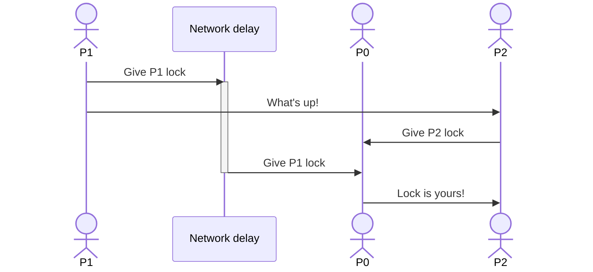
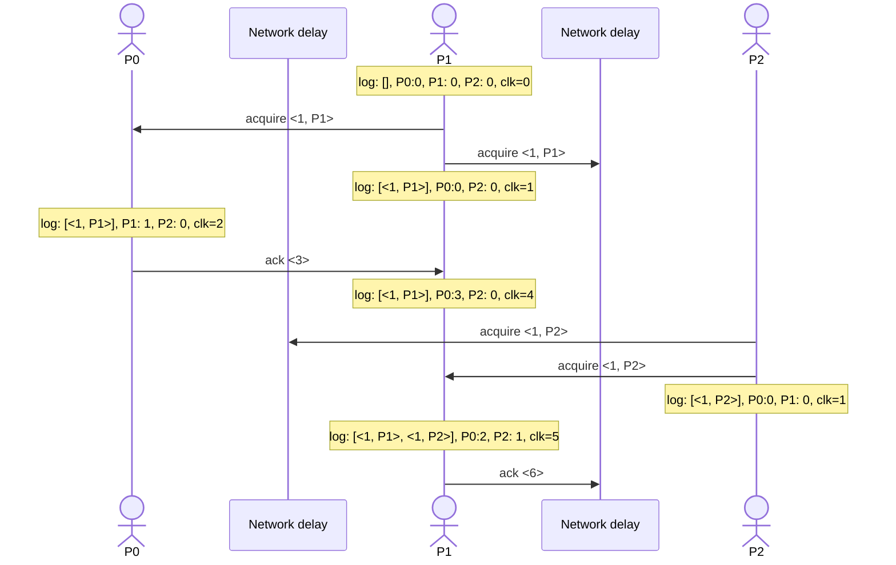

# Time, Clocks, and the Ordering of Events in a Distributed System
Keywords: #clocks

## Happens-before is a partial-order
The point of this paper is that *happens-before* relationship in a distributed
system is a partial order because the clocks are not perfectly synchronized. We
can infer this partial order between events in processes via the messages
exchanged between them.

* Within a process, instruction order follows the program order
* Across two processes, a send must have happened before a receive.

Using these two intuitive rules, we can define a logical clock as follows:
* If this event (instruction) does not send/receive a message, just increment the
  clock.
* If I send a message, send my clock in the message 
* If I receive a message, set my clock to max(send+1, my clock). 

Basically, fast forward my clock to be ahead of the sender when I receive a
message. The steps above assigns a logical clock value to each event on each
process. But in general, other assignments are also possible that satisfy our
intuitive event ordering requirements.

Happens-before relationship defined in this way essentially captures
*causality*. If $a\rightarrow b$, then the event $a$ may have affected the event
$b$.  Two events are concurrent if $a\not\rightarrow b$ and $b\not\rightarrow
a$. Therefore, neither event can causally affect the other event. Since,
concurrent events are always on two different processes, we can turn a partial
order into a *total order* by introducing an arbitrary $\prec$ between processes.

## Mutex
The paper further describes a *fair replicated state machine algorithm,
without failing processes*, using logical clocks. It is described by showing 
a fair mutex implementation. The goal of this implementation is:
* *Safety*: Lock should be given to another process only after the current
  process has released it.
* *Liveness*: If every process eventually releases their locks, then every 
  request will be granted.
* *Fairness*: Different requests for the resource must be granted in the order
  in which they are made.

The first thing paper says is that the spec does not say anything about
concurrent requests. Fairness is specified intuitively. But the *order* in the
fairness condition is only a partial order. Therefore, the system is free to do as 
it wishes for concurrent requests.

One obvious design is that a central server maintains the lock and gives out the
locks in a FIFO manner. However, the paper cribs that this is not fair.  This
implementation is respecting the order according to the physical clock of the
central server. But, it should be respecting the happens-before order of when
the request originated. In particular, let's say `P0` is the central server:

Due to the network delay, P1's request to get the lock reached later than P2's
request to get the lock. Even though P1's request *happens-before* P2's request,
P0 still gave the lock to P2.

The paper proposes a fair distributed algorithm that does not require a
centralized server. The algorithm assumes that it works above something like
TCP, i.e, for a given sender-receiver pair:
* each sent message is received eventually, and
* messages are received in the same order as the order in which they were sent.

Each process locally maintains a log of lock acquire requests and is maintaining
logical clock as described before. Further, each process remembers the clock of
the last message that it has heard from each process. Whenever, a process
wants to acquire, it sends a broadcast with <clk, proc_id> to every other process.
A process can safely acquire the lock if 
* there are no other messages in its log that are earlier (we are enforcing
  total order) than its own acquire request, and
* it has heard something from every other process with a timestamp greater than 
  when the process had raised its acquire request.

See the following interaction assuming the system is starting afresh:

Now, in this state `P1` will be able to acquire the lock (assuming $P1 \prec
P2$) even though `P2` has not yet received the acquire request from `P1` yet!
This is because `P1` is just going to locally check if the last time it heard
from everyone is equal to or later than the time at which it sent the acquire
request.

Acquiring the lock at this point is safe for `P1` because we assume that the
network is ***not reordering messages***:
* `P2` must first hear `acquire <1, P1>` before it hears `ack <6>` from `P1`. 
* Since, `P1` is sure that everyone is caught up and because message it has
  heard from others were also not reordered, it is not possible that it is 
  unaware of some requests like `<0, P0>`.

The paper then extends this argument to say that we can now replicate a state
machine since we have a guaranteed global ordering in our logs! The assumption
is that state machine is fully connected. Formally, the state machine has states
$S$ and the execution function $e$ runs a command $C$ to take the machine to
another state, i.e, $e: C \rightarrow S \times S$. This definition is important 
because when we are ready to run a command, we might be in a different state
than when we launched the request to run the command.

But of course, since every process is required to participate for every lock
acquire request (or to add a command in the state machine), this algorithm is 
not fault tolerant. The paper hints at an upcoming paper that is fault tolerant!

## Out-of-band communication
The paper further discusses the problem of maintaining clocks and happens-before
relationship when out-of-band communication is possible. The example that they
give is that:

> Consider a nationwide system of interconnected computers. Suppose a person
issues a request `a` on a computer `A`, and then telephones a friend in another
city to have him issue a request `b` on a different computer `B`. It is quite
possible for request `b` to receive a lower timestamp and be ordered before
request `a`. This can happen because the system has no way of knowing that `a`
actually preceded `b`, since that precedence information is based on messages
external to the system.

This sounds like a made-up example but this can very much happen. For example,
the clock was maintained when processes were passing messages to one another but
process-1 wrote to the file system and process-2 read from the file system.
While doing so, we did not maintain the clock.

To avoid such problems, the first thing we can do is to properly maintain
logical clocks across reads and writes to the file system, i.e, whenever the
user does an out-of-band communication, they pass the logical timestamp and 
appropriately update it.

The paper spends effort on not forcing users to maintain the timestamp. The
desirable property is that if there is a causal relationship between two events 
than our clock captures it. Formally, if $a \twoheadrightarrow b$, then $C(a) <
C(b)$ where $\twoheadrightarrow$ subsumes the happens-before relationship
$\rightarrow$ seen by the system via message passing. $\twoheadrightarrow$
additionally contains causality coming from out-of-band communication.

The main idea is that we would like our clocks to sync faster than how quickly
the out-of-band communication can happen. For instance, if we know that the file
system write followed by a file system read is much slower than the worst-case
clock drift then we are ok.

The paper maintains physical clocks in a manner similar to maintaning the
logical clock. Everytime a process receives a message, it advances the physical
clock to `max(self physical clock reading, time at which the message was sent +
minimum IPC delay)`.