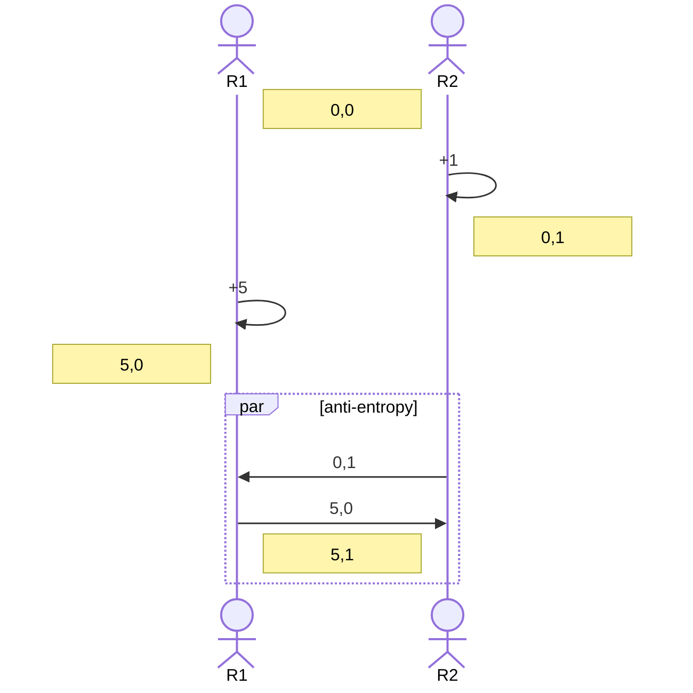
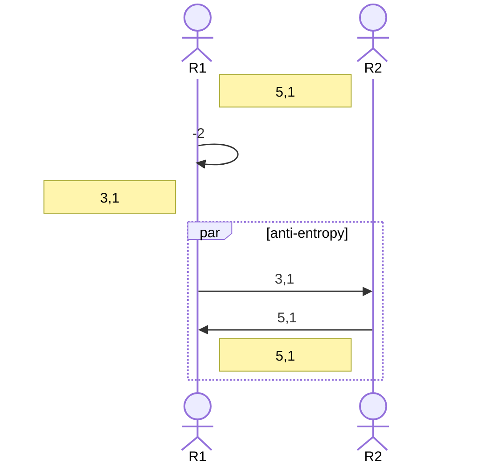
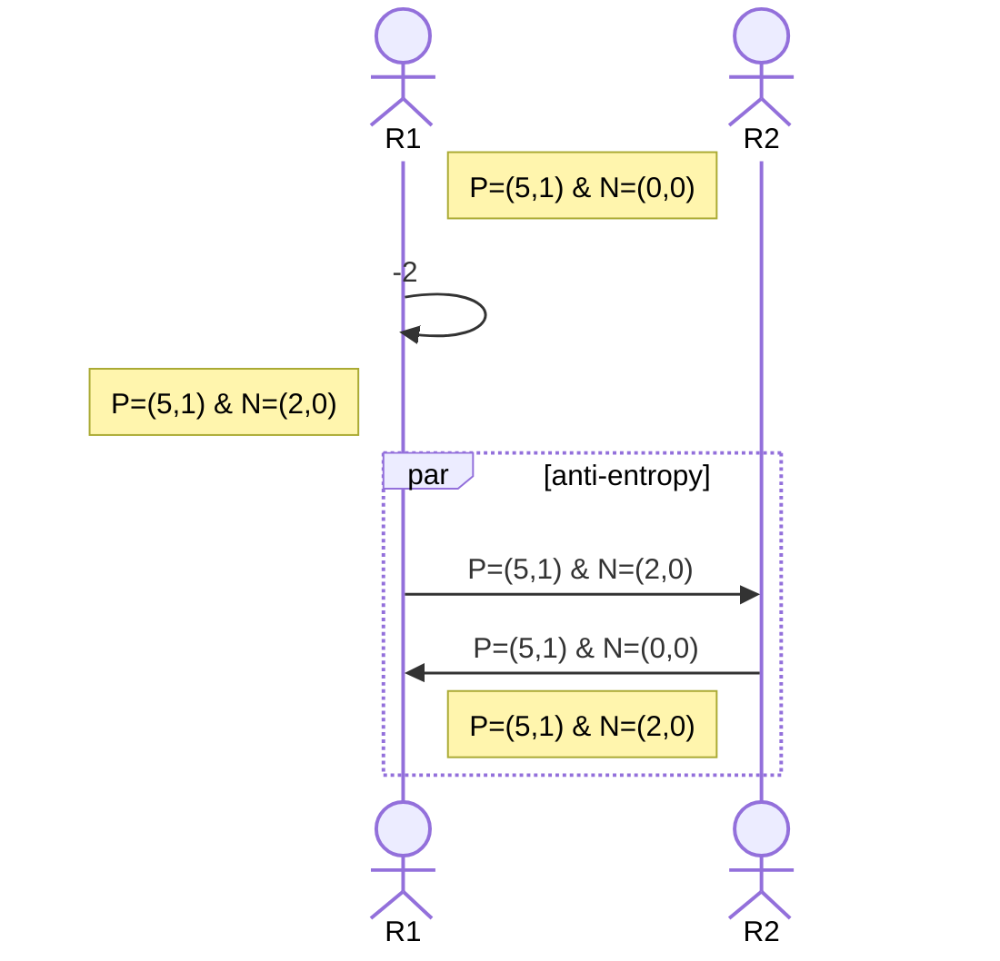
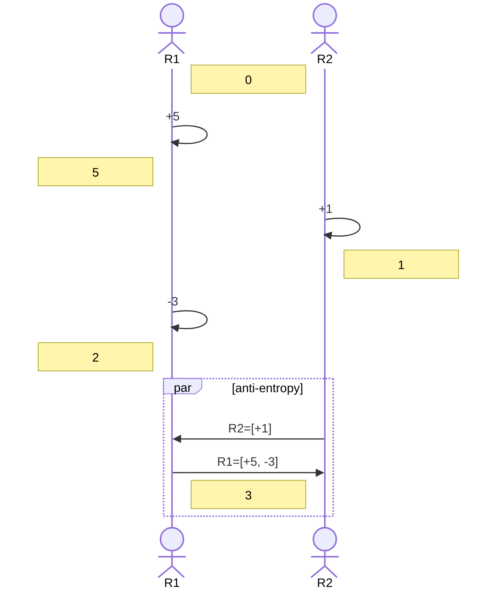

# Conflict-free Replicated Data Types
Keywords: #eventual #consistency #crdt

In [[paper-2014-atc-raft]], we replicate the state machine by playing *the same
log in the same order* on all the replicas. We ensure that replicas never
diverge by ensuring *state machine safety property*. The property says that if
I've applied a particular entry at a particular log index, every other replica
*must apply* the same log entry at that log index. But of course Raft is a CP
system so we prioritize safety: we don't want anyone to apply a log entry unless
we know that that entry is committed.

In an AP system like [[paper-2007-sosp-dynamo]], we want to *eventually
replicate* the state machines. The state machines need to *diverge temporarily*
to provide high availability. The replicas can do anti-entropy with one
another or let the clients do the merge to *eventually* end up in the same state,
i.e, if clients stop writing and replicas are able to talk to each other
(directly via anti-entropy or indirectly via client merges), then they should end
up in the same state. [[paper-1995-sigops-bayou]] does this and calls it
*eventual consistency* but its approach has two shortcomings:
* a primary server decides the global commit order of the logs, similar to how
the Raft leader decides the global commit order (atleast for its own term). Even
if non-primary servers can talk to each other, they can not know the global
commit order;
* for high availability, non-primary servers tentatively apply writes before
learning the global commit order from the primary. After learning the global
commit order, these replicas need to *rollback* the tentative writes that were
applied out of order. These rolled back writes will be applied later in the
correct order as decided by the primary.  Therefore, non-primary servers need to
maintain two copies of the datastore: *committed* and *tentative*.

But, the advantage of Bayou's approach is that there is no assumption over the 
type of modifications made by the clients. State machines *eventually* converge
because they *eventually* apply the writes in a *common global order* decided by
the primary.

### Strong eventual consistency (SEC)

This paper criticizes these two problems for eventual consistency and proposes 
*strong eventual consistency*. Under strong eventual consistency, replicas
end up in the same state *as soon as* they have learned of the *same causal
history*. Under this definition, there is no need for a primary: replicas 
automatically end up in an identical state after syncing. Also replicas *never
rollback* any write since they anyways converge immediately. 

However, the shortcoming is that SEC is achievable only when operations commute.
Interestingly, this was already mentioned in the [[paper-1995-sigops-bayou]]
paper, but they did not think it was an important subproblem as such:

> In theory, the execution history at individual servers could vary long as the
execution was equivalent to some global write ordering. For example, writes
known to be commutative could be performed in any order. In practice, because
Bayou’s write operations include arbitrary merge procedures, it is effectively
impossible either to determine whether two writes commute or to transform two
writes so they can be reordered as has been suggested for some systems.

This paper mentions two replicated data types that support SEC: state-based 
convergent replicated data types and operation-based commutative replicated data
types. The paper later shows that one can be transformed into another so they
both have equal expressive power.

### State-based convergent replicated data types

Here, the replicas sends over their states when they wants others to get
updated. This syncing could be done directly during anti-entropy or indirectly
during a client-side merge. Convergent RDTs want the state to form a
semi-lattice where both updates and merges are *monotonic* on the semi-lattice.

> Remember that a semilattice only has a least upper bound (which defines our
merge function). The LUB follow commutativity, idempotence, and associativity.
Semilattice need not have a greatest lower bound.

#### Grow counter (G-counter)

Vector of ints are used to keep a counter. Only allowed updates are increments. 
`merge` takes a `max` for each component. From the point of view of programmer,
they are just calling `.increment` and `.get`. `.get` returns the value of the
counter by summing up all components. 



#### P-N counter

We *cannot* allow decrement in G-counter because then the updates will go in the
*opposite direction* of the merge on the semi-lattice formed by the vector of 
ints. For example continuing the example above, after merge we lose the
decrement by 2.



Therefore in PN counter, one vector of ints is used to maintain increments and
another is used to maintain decrements. Merge function takes a max on components
of both vectors. Value of the counter is (the sum of P counters - the sum of N
counters).



#### Grow only set

[[paper-2007-sosp-dynamo]] describes a grow-only set that forgets deletes.  It
is very similar in essence to the grow only counter that forgets decrements. The
merge operator is union.

#### U-set or 2P set

We can apply the same trick to remember deletes from the set. We maintain two
grow only sets: one for adding elements ($A$) and one for deleting elements
($R$).  An element is considered to be in the set if it is present in $A
\setminus R$. However with this, the deletes win over adds. Once an element is 
deleted, it can never be added again.

#### LWW element set

Here, we also remember the timestamp when the element was added or deleted in 
the $A$ and $R$ sets. Each of the two sets form a sublattice like the following:
(here b@1 means that the element 'b' was added at timestamp 1).

```
       {a@1, b@1}
       /        \
{a@1, b@0}     {a@0 b@1}
    |      \    /     \
{a@1}    {a@0, b@0}  {b@1}
     \    /    \    /
      {a@0}     {b@0}
           \  /
            {}
```

An element is considered to be in the set if its timestamp in $A$ is later than 
its timestamp in $R$.

#### Operations based commutative replicated data types

Here, the replicas send over *operations* on the data instead of sending the
state. Again the operations can be sent directly or indirectly. The assumption
is that the operations are delivered in the order in which they were seen by the
replica. Operations from two different replicas can be recieved in any order.
Since operations will apply side effects (like incrementing a counter), we also
assume that the operations can be de-duplicated by the receiver. 

All this is easy to implement: basically each server can have an independent log
of operations. Each operation can have a unique ID that is incremented by the
server that owns this log. Replicas can de-duplicate log entries with their ID. 
They can remember the `appliedIndex` on each log.



In the example above, the state is just a number. Replicas send a log of
operations to one another. Upon receiving the operations, replicas applies the
operation log from the other. Since the two replicas are applying operations in
different orders, clearly the states converge iff the operations from different 
replicas commute. 

Note that the increment and decrement commute so keeping just one integer
suffices. Whereas for set operations, adding an element and removing an element 
do not commute with each other. So, keeping just one set and doing adds and
removes will not be a CmRDT.  We will need to keep two sets like the U-Set or 
the LWW elements set.

#### Equivalence

The paper also shows that state-based CRDTS can be represented using
operations-based CRDTs and vice versa. Informally:

1. To represent state-based CRDT using operations-based CRDT, remember the
side-effect done by each update as an operation. For example, remember $(0,0)
\rightarrow (0,3)$ as $+3_0$. Since merge commutes, these operations from
different replicas shall also commute.  

2. To represent operation-based CRDT using state-based CRDT, put the
operation log in the state. At the time of merge, we merge all the operation
logs by separately maintaining operation logs from each replica. We can apply
operation logs from different replicas in any order.

## Strong eventual consistency vs sequential consistency

There is an interesting discussion in Section 3.3. 

* The focus of sequential consistency is that the observed behavior is
equivalent to a sequential behavior. For example, `add(e)` followed by
`remove(e')` ensures that $e \in S, e' \notin S$. 
* The focus of SEC is only that ***the replicas converge*** after exchanging
some updates from one another. [[paper-2007-sosp-dynamo]]'s shopping cart IS SEC
since replicas converge but it is clearly not SC as it forgets item deletions.